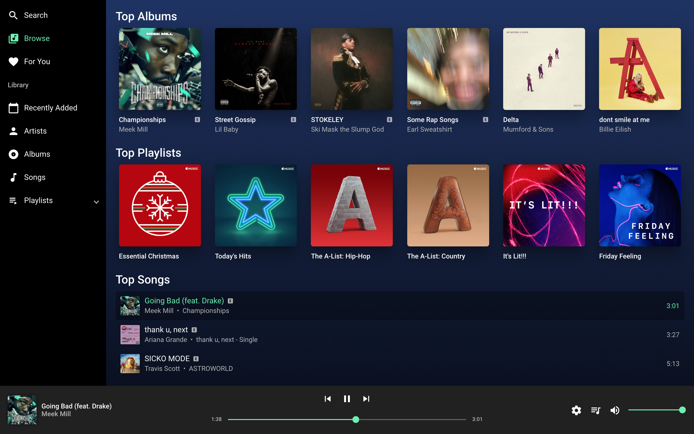
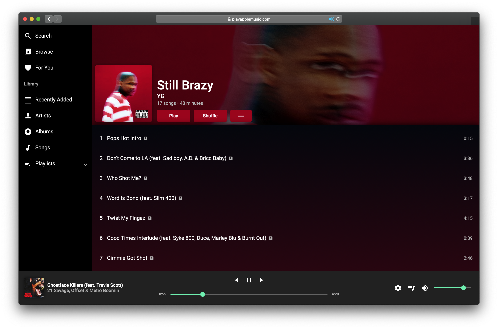

# Apple Music Web Player

A Progressive Web App for Apple Music built with Angular, Angular Material, and [MusicKit JS](https://developer.apple.com/documentation/musickitjs).

* [Apple Music Web Player](#apple-music-web-player)
* [Screenshots](#screenshots)
* [Development server](#development-server)

## Screenshots




## Development server

Run `ng serve --aot` for a dev server. Navigate to `http://localhost:4200/`. The app will automatically reload if you change any of the source files.

### Replacing the tokens

The Apple Music tokens are kept in the $project/environments folder. These tokens must exist for the application to run.
The following is how to replace the tokens in the environment folder using Bash:

```Bash
cd $projectFolder/environments/
APPLE_MUSIC_TOKEN="Your AM token here"
sed -i "/token/c\   token : \x27${APPLE_MUSIC_TOKEN}\x27" environment.ts
```